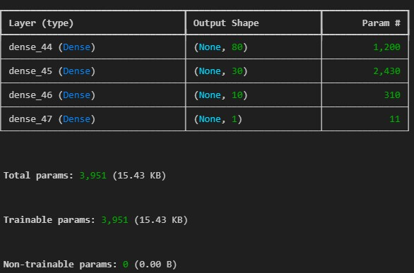
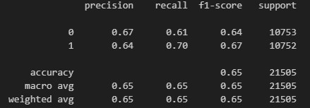
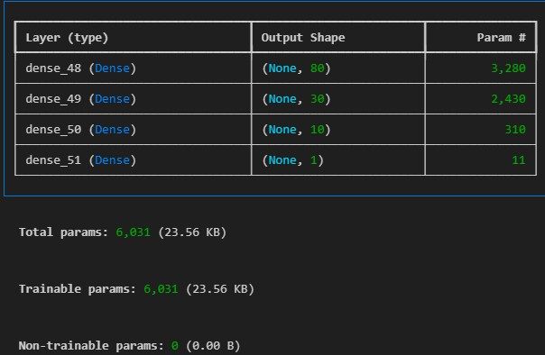
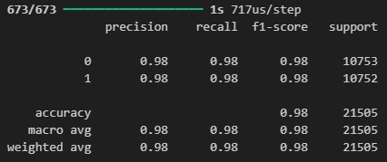

# Project4-ML

# Project Proposal: Analyzing the risk of credit card applicants
### Project Objective:
This project focuses on analyzing and predicting the risk levels of credit card applicants based on their demographic, financial, and application-related features. By utilizing machine learning techniques, the goal is to identify applicants who are "risky" or "not risky" based on patterns from historical data.

## Dataset Overview:
https://www.kaggle.com/code/rikdifos/credit-card-approval-prediction-using-ml

### Characteristics:
Gender  
Age 
Education Level 
Marital Status 
Income Total 
Income Type 
Housing Type 
Own Car (Yes/No) 
Own Realty (Yes/No) 
Own Phone (Yes/No) 
Family Members 
Employment Type 
Children Count 
Family Status

### Target Variable:
"Risky"  
Any of the applicants with the following: 
2: 60-89 days overdue   
3: 90-119 days overdue   
4: 120-149 days overdue   
5: Overdue or bad debts, write-offs for more than 150 days    
"Not Risky"  
Any of the applicants with the following: 
C: paid off that month   
X: No loan for the month  
0: 1-29 days past due   
1: 30-59 days past due   

### Information Value (IV) and Weight of Evidence (WoE)
We took all the categories and ran them through a function that determined information values per category against the target column. 

Purpose of Good and Bad Counts:
Weight of Evidence (WoE):
Compares the distribution of "good" and "bad" outcomes for each feature value.
Helps in determining how well the feature separates the target classes.

Information Value (IV):
Quantifies the predictive power of the feature by aggregating the differences between "good" and "bad" distributions across all feature values.

## Machine Learning Approach:
### Supervised Learning:
Build a classification model (logistic regression, decision tree, random forest, and neural networks) to predict risk/no risk based on data.

## Neural Networks
When we only ran target column against parameters with high information values it resulted in an accuracy of 65.31%.
Suggests that ~35% of samples are misclassified, but it doesn't reveal if high-risk cases are disproportionately affected. 

 
When we ran the target column against all parameters except id, Housing Type, and if they had a phone, work phone, or email the model improved resulting in 97.72%.  
Feature Completeness:
By excluding only object columns and the target, the model now has access to more relevant numerical and categorical data (potentially after encoding), which contributes to its ability to capture patterns in the data. 
Complex Relationships:
More features allow the model to learn complex interactions between variables that were missing when only 5 high-IV features were used. 

 
### Unsupervised Learning:
Use clustering algorithms (K-means, hierarchical clustering) to identify distinct groups of risky and non risky applicants who share similar characteristics and outcomes

## Potential Impact:
This project helps financial institutions improve decision-making for credit card approvals by accurately identifying high-risk applicants while minimizing defaults. The goal is to produce fair and data-driven decisions for applicants, increasing approval rates for low-risk individuals. 
